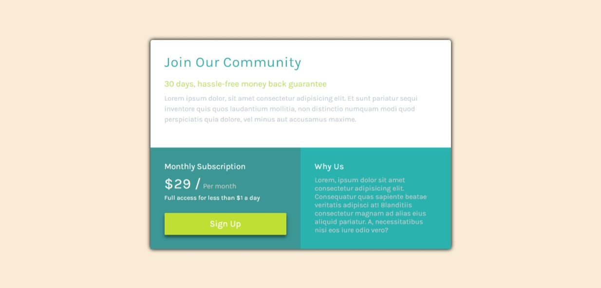

# Frontend Mentor - Single price grid component solution

This is a solution to the [Single price grid component challenge on Frontend Mentor](https://www.frontendmentor.io/challenges/single-price-grid-component-5ce41129d0ff452fec5abbbc). Frontend Mentor challenges help you improve your coding skills by building realistic projects. 

## Table of contents

- [Overview](#overview)
  - [The challenge](#the-challenge)
  - [Screenshot](#screenshot)
  - [Links](#links)
- [My process](#my-process)
  - [Built with](#built-with)
  - [What I learned](#what-i-learned)
  - [Continued development](#continued-development)
  - [Useful resources](#useful-resources)
- [Author](#author)

## Overview

### The challenge

Users should be able to:

- View the optimal layout for the component depending on their device's screen size
- See a hover state on desktop for the Sign Up call-to-action

### Screenshot

 
   

## My process

### Built with

- Semantic HTML5 markup
- CSS custom properties
- Flexbox

### Continued development

 I have to put focus on Responsiveness

### Useful resources

- [resource 1](https://www.w3schools.com/) - This helped me for media query and button hover effect. I really liked this website.
- [resource 2](https://developer.mozilla.org/en-US/) - This is an amazing website for any web related issues. This helped me in building flex model.

## Author

- Website - [Abhishek Tiwari]
- Frontend Mentor - [@itssabhishek](https://www.frontendmentor.io/profile/itssabhishek)
